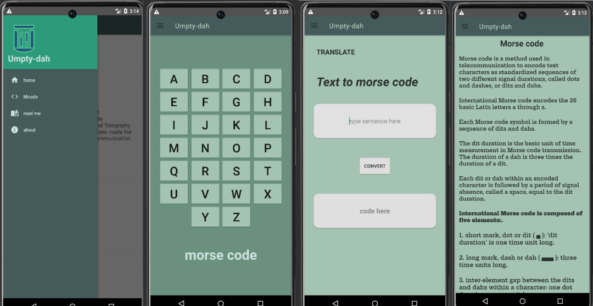

# Umpty-dah
#### Video Demo:  <https://youtu.be/lrL-VSv4E7c>
#### Description:
 > Umpty-dah is android application made using java which converts english alphabets into morse code.

 MORSE CODE is a telecomunication language which was used by the military and the aircraft pilots to easily communicate with each other without using much energy.

 morse code was also used by the army in the world war to encrypt the communication between the troops without the enemy knowing.

 to know more click here [MORSE CODE.](https://en.wikipedia.org/w/index.php?title=Morse_code&oldid=1145114509)

### umpty-dah app has:
 1. interactive home page.
 2. text to morsecode page.
 3. morse code info page.
 4. about page.

Application look

the applicationa apk file can be found in the file path:
##### umptydah\app\release\app-release.apk

for designing my app logo i used [inkscape.](https://inkscape.org/)

and for colorgrading my app i used an opensource software called[Rickrack.](https://eigenmiao.com/rickrack/)
